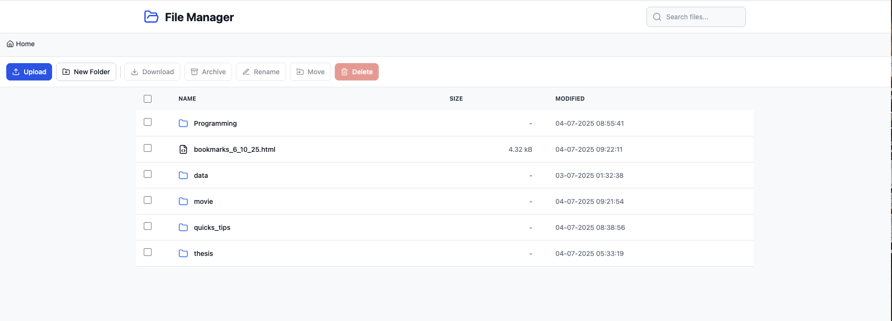
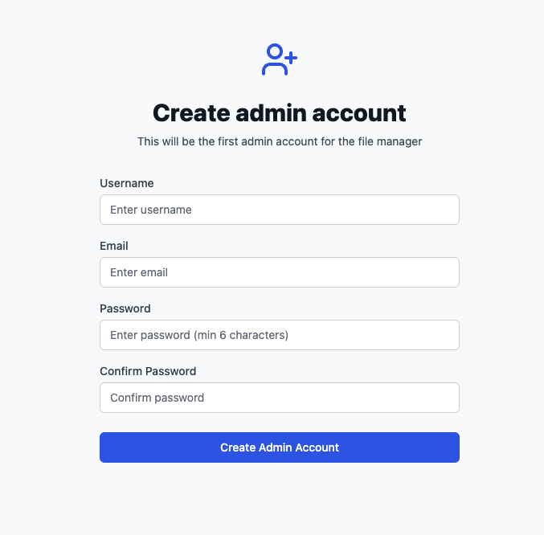
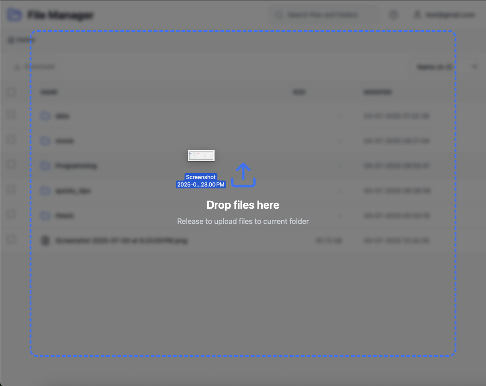
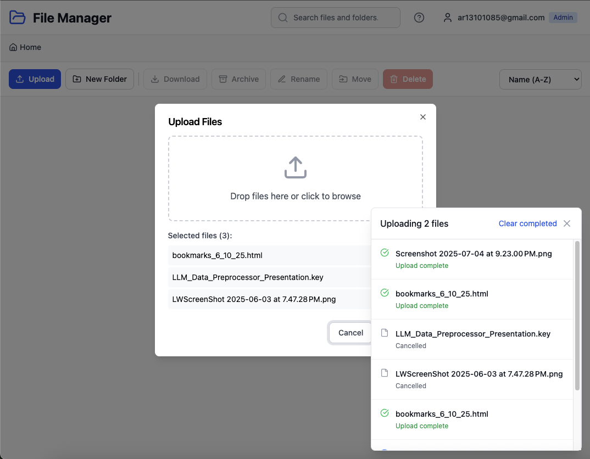
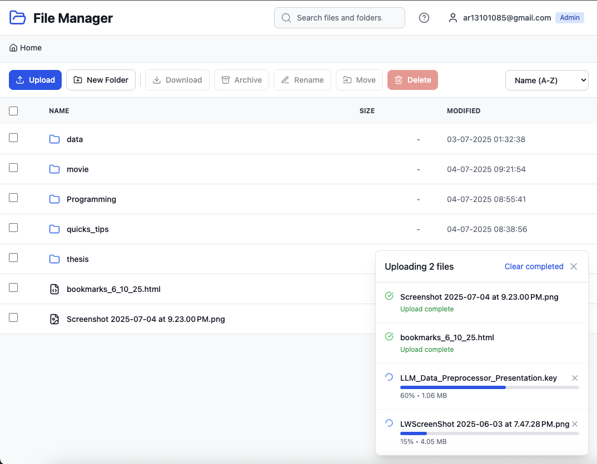
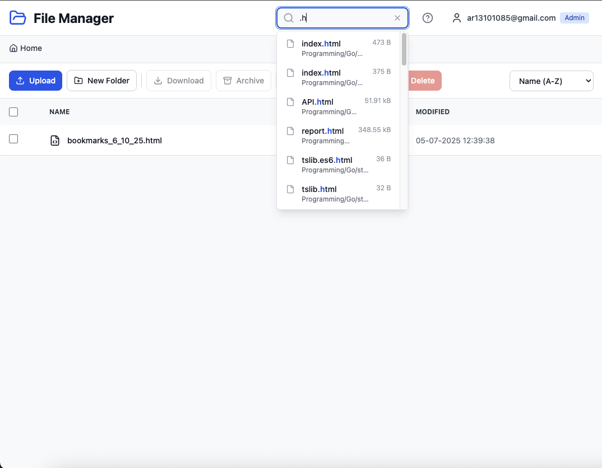
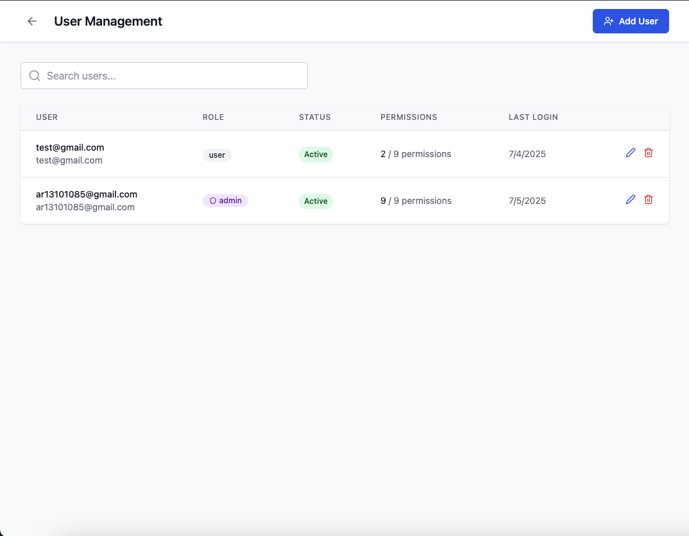
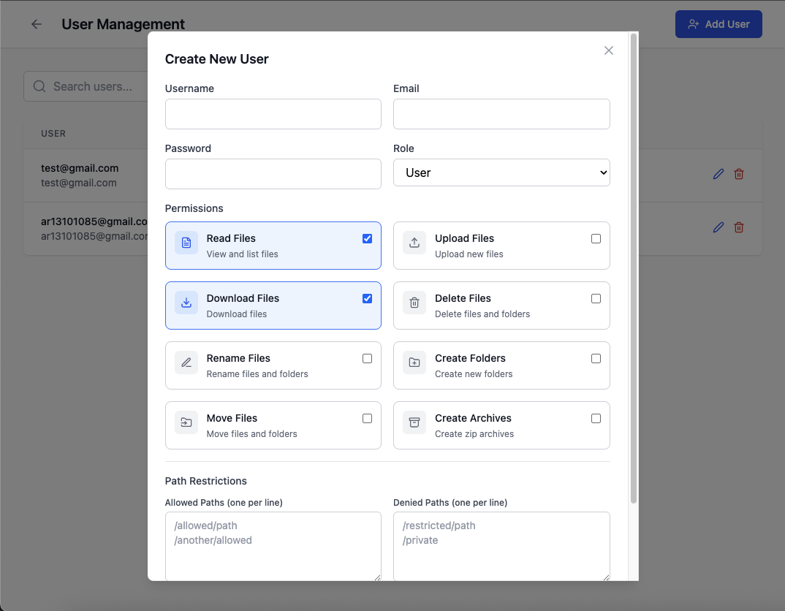

# Modern File Manager

A full-stack web-based file manager with a modern UI, built with React, TypeScript, Node.js, and Tailwind CSS. Features include authentication, role-based permissions, file operations, and real-time search.


## 📋 Table of Contents

- [Screenshots](#screenshots)
- [Features](#features)
- [Tech Stack](#tech-stack)
- [Installation](#installation)
- [API Endpoints](#api-endpoints)
- [Permission System](#permission-system)
- [Keyboard Shortcuts](#keyboard-shortcuts)
- [Security Features](#security-features)
- [Contributing](#contributing)
- [License](#license)

## Screenshots

### Home Screen

*Clean and modern file manager interface with breadcrumb navigation*

### Authentication

*Secure login page*


*First user registration becomes admin automatically*

### File Operations

*Drag and drop files directly into the browser*


*Traditional file upload dialog*


*Upload multiple files with progress tracking and ability to cancel*

### Search Features

*Powerful search with autocomplete, nested folder search, and local filtering*

### User Management

*Admin dashboard for managing users*


*Create new users with custom permissions*

## 🚀 Quick Start

```bash
# Clone the repository
git clone https://github.com/yourusername/file-manager.git
cd file-manager

# Install and start backend
cd backend
npm install
npm run dev

# In a new terminal, install and start frontend
cd ../ui
npm install
npm run dev

# Open http://localhost:5173 in your browser
```

## Features

### 🔐 Authentication & Authorization
- JWT-based authentication system
- User roles (Admin/Regular User)
- Fine-grained permission system
- First user automatically becomes admin
- Session management with token expiration

### 📁 File Operations
- Browse files and folders
- Upload single/multiple files with progress tracking
- Download files and folders
- Create new folders
- Rename files and folders
- Move files to different locations
- Delete files and folders
- Archive multiple files into ZIP

### 🔍 Advanced Search
- **Local Search**: Instant filtering of current folder contents
- **Nested Search**: Search across all subdirectories
- Real-time search with debouncing
- Autocomplete with file paths
- Keyboard navigation (Arrow keys, Enter, Escape)
- Click to navigate to file location

### 🎨 Modern UI/UX
- Clean, responsive design with Tailwind CSS
- Dark mode support
- Drag and drop file upload
- Context menu (right-click) actions
- Keyboard shortcuts
- File type icons
- Breadcrumb navigation
- Sort files by name, size, date, or extension

### 👥 User Management (Admin Only)
- Create new users
- Update user permissions
- Enable/disable user accounts
- Delete users
- Custom permission settings per user

## Tech Stack

### Backend
- **Node.js** with Express.js
- **TypeScript** for type safety
- **LevelDB** for user/session storage
- **JWT** for authentication
- **Multer** for file uploads
- **Archiver** for ZIP creation

### Frontend
- **React 19** with TypeScript
- **Vite** for fast development
- **Tailwind CSS** for styling
- **Radix UI** for accessible components
- **React Router** for navigation
- **Axios** for API calls

## Installation

### Prerequisites
- Node.js 16+ 
- npm or yarn

### Backend Setup

1. Navigate to the backend directory:
```bash
cd backend
```

2. Install dependencies:
```bash
npm install
```

3. Create a `.env` file:
```env
PORT=3001
DIR=/path/to/files/directory
JWT_SECRET_KEY=your-secret-key-here
```

4. Build and start the server:
```bash
npm run build
npm start
```

For development:
```bash
npm run dev
```

### Frontend Setup

1. Navigate to the UI directory:
```bash
cd ui
```

2. Install dependencies:
```bash
npm install
```

3. Start the development server:
```bash
npm run dev
```

4. Build for production:
```bash
npm run build
```

## API Endpoints

### Authentication
- `POST /api/v1/auth/signup` - Register first admin user
- `POST /api/v1/auth/signin` - User login
- `POST /api/v1/auth/logout` - User logout
- `GET /api/v1/auth/me` - Get current user info

### File Operations
- `POST /api/v1/file/files` - List files in directory
- `POST /api/v1/file/create-dir` - Create new folder
- `POST /api/v1/file/upload-files` - Upload files
- `POST /api/v1/file/delete-files` - Delete files
- `POST /api/v1/file/rename-files` - Rename files
- `POST /api/v1/file/move-files` - Move files
- `POST /api/v1/file/archive-files` - Create ZIP archive
- `GET /api/v1/file/search` - Search files recursively

### Admin Operations
- `GET /api/v1/admin/users` - List all users
- `POST /api/v1/admin/users` - Create new user
- `PUT /api/v1/admin/users/:userId` - Update user
- `DELETE /api/v1/admin/users/:userId` - Delete user

## Permission System

Users can have the following permissions:
- `canRead` - View files and folders
- `canWrite` - Modify existing files
- `canDelete` - Delete files and folders
- `canUpload` - Upload new files
- `canDownload` - Download files
- `canCreateFolder` - Create new folders
- `canRename` - Rename files and folders
- `canMove` - Move files to different locations
- `canArchive` - Create ZIP archives

Admins have all permissions by default. Regular users can be granted specific permissions by admins.

## Keyboard Shortcuts

- `Ctrl/Cmd + A` - Select all files
- `Delete` - Delete selected files
- `F2` - Rename selected file
- `Escape` - Clear selection
- `?` - Show keyboard shortcuts dialog

## Security Features

- JWT tokens with 7-day expiration
- Password hashing with bcrypt
- Session management
- Request validation
- Path traversal protection
- File type restrictions (configurable)

## Contributing

1. Fork the repository
2. Create your feature branch (`git checkout -b feature/amazing-feature`)
3. Commit your changes (`git commit -m 'Add some amazing feature'`)
4. Push to the branch (`git push origin feature/amazing-feature`)
5. Open a Pull Request

## License

This project is licensed under the MIT License - see the LICENSE file for details.

## Acknowledgments

- Built with modern web technologies
- Inspired by traditional file managers with a modern twist
- Thanks to all contributors